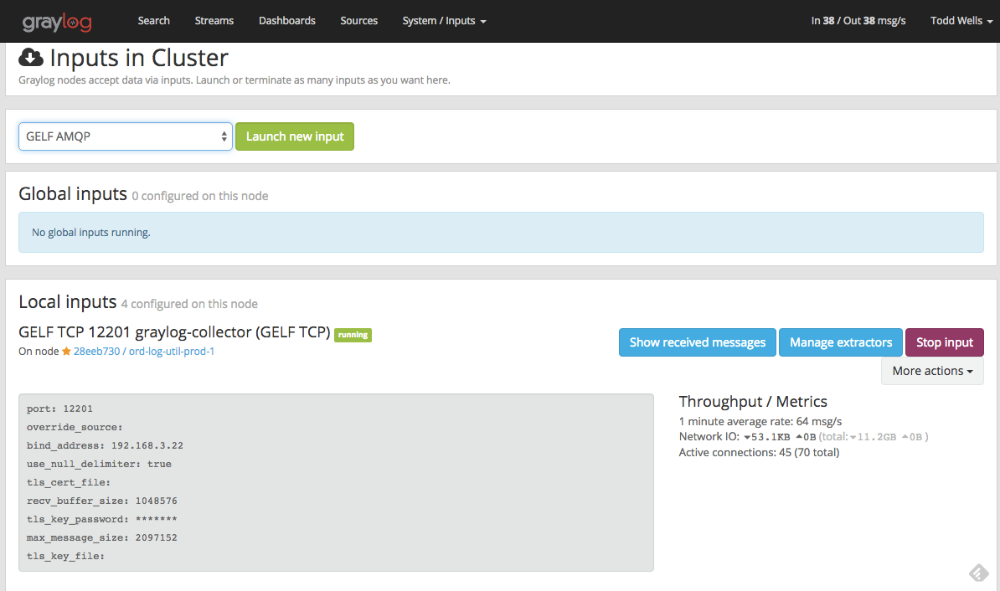
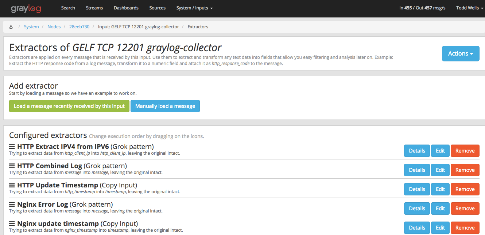

# Graylog content pack for nginx using gelf input from Graylog Collectors.  

This content pack creates a GELF collector for use by the graylog-collector.  Extractors are applied to all messages to extract nginx access log fields and error log severity.  Graylog timestamp is set to the timestamp in the access/error log.  Extractors look for combined log format, so other applications using combined log format should also be matched by these extractors ( apache, node.js/morgan).

The graylog collector needs to be installed on your web servers.  See collector.conf.EXAMPLE for a sample configuration to collect nginx logs from /var/log/nginx and send them to the GELF input on graylog server.

